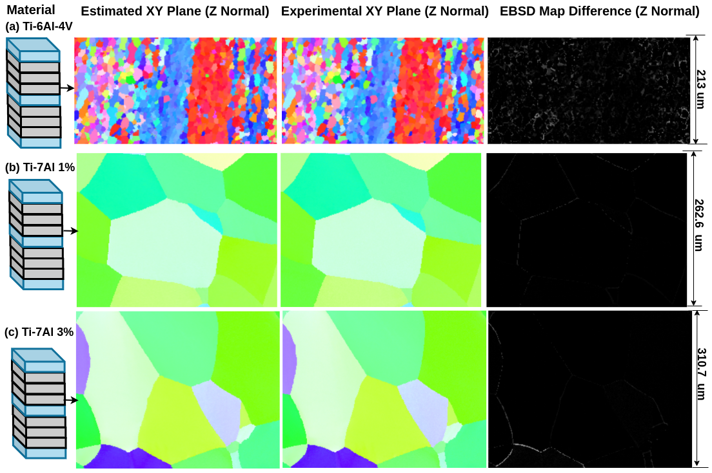

# Q-RBSA
High-Resolution 3D EBSD Map Generation Using An Efficient Quaternion Transformer Network

[Devendra K. Jangid](https://sites.google.com/view/dkj910), [Neal R. Brodnik](https://scholar.google.com/citations?user=3dAoFJkAAAAJ&hl=en), [McLean P. Echlin](https://scholar.google.com/citations?user=fxN2OsUAAAAJ&hl=en), [Tresa M. Pollock](https://materials.ucsb.edu/people/faculty/tresa-pollock), [Samantha H. Daly](https://scholar.google.com/citations?user=3whYx4UAAAAJ&hl=en), [B.S. Manjunath](https://scholar.google.com/citations?user=wRYM4qgAAAAJ&hl=en)

[Paper](https://arxiv.org/abs/2303.10722)

<hr />

> **Abstract:** *Gathering 3D material microstructural information is time-consuming, expensive, and energy-intensive. Acquisition of 3D data has been accelerated by developments in serial sectioning instrument capabilities; however, for crystallographic information, the electron backscatter diffraction (EBSD) imaging modality remains rate limiting. We propose a physics-based efficient deep learning framework to reduce the time and cost of collecting 3D EBSD maps. Our framework uses a quaternion residual block self-attention network (QRBSA) to generate high-resolution 3D EBSD maps from sparsely sectioned EBSD maps. In QRBSA, quaternion-valued convolution effectively learns local relations in orientation space, while self-attention in the quaternion domain captures long-range correlations. We apply our framework to 3D data collected from commercially relevant titanium alloys, showing both qualitatively and quantitatively that our method can predict missing samples (EBSD information between sparsely sectioned mapping points) as compared to high-resolution ground truth 3D EBSD maps.*
<hr />


## Installation
Step 1: Clone repo  

      git clone "https://github.com/UCSB-VRL/Q-RBSA.git"
      
Step 2: Create Virtual environment

      virtualenv -p /usr/bin/python3.10 qrbsa_venv(name of virtual environment)

Step 3: Activate Virtual environment

      source qrbsa_venv/bin/activate
      
Step 4: Download Dependencies

      pip install -r requirements.txt
      
Step 5: Install gradual warmup scheduler. Go to pytorch-gradual-warmup-lr folder

       python setup.py install
       

## Training 
Run
```
./train.sh
```
<table>
      <tr>
          <th align="center">Loss</th>
          <th align="center">dist_type</th>
           <th align="center">syms_req</th>  
      </tr>
       <tr>
          <td align="center">L1</td>
          <td align="center">L1</td>
          <td align="center">False</td>  
      </tr>
       <tr>
          <td align="center">L1 with symmetry</td>
          <td align="center">L1</td>
          <td align="center">True</td>  
      </tr>
        <tr>
          <td align="center">Rotational distance approximation with symmetry</td>
          <td align="center">rot_dist_approx</td>
          <td align="center">True</td>  
      </tr>
<table>


Define the following parameters to train network
   
* ```--input_dir```: "Directory Path to Datasets"
* ```--hr_data_dir```: "Path to High Resolution EBSD Maps relative to input_dir"
* ```--val_lr_data_dir```: "Path to Low Resolution EBSD Val Datasets"
* ```--val_hr_data_dir```: "Path to High Resolution EBSD Val Datasets"
* ```--model```: "Choose one of network architectures from edsr, rfdn, san, han"
* ```--save```: "Folder name to save weights, loss curves and logs"
   
Important parameters in argparser.py 
   
* ```--syms_req```: "It tells whether you want to use symmetry or not during Loss calculation"
* ```--patch_size```: "Max Size of Patch During Training"
* ```--act```: "Activation Function in Network"
* ```--save_model_freq```: "How frequently do you want to save models"

## Evaluation
      
We will provide inference model on [BisQue](https://bisque2.ece.ucsb.edu/client_service/) as module after publication of paper. You do not need to use following steps if you are using Bisque infrastructure. 

      
Download trained weights for QRBSA network [here](https://drive.google.com/drive/folders/12ILcyCBJENrYvBxDcCwQAVNzSpofFN8q)

Put it in ```./experiment/saved_weights/{name_of_file}/model/{name_of_file}.pt```
 
### For example 
      
If you use qrbsa 1D with rotational distance approximation loss:
```
./experiment/saved_weights/edsr_l1_ti64/model/edsr_l1_ti64.pt
```      

```--model```: qrbsa_1d
      
```--save```: 'qrbsa_1d_rotdist'
      
```--model_to_load```: 'model_best'
      
```--dist_type```: 'rot_dist_approx'
      
```--test_only```    
Run
```
./test.sh
```
The generated results will be saved at ```experiments/saved_weights/qrbsa_1d_rotdist/results/Test_model_best``` in npy format. It will also generate images (.png) for each quaternion channel.

## Visualization
The model will generate superresolved EBSD map in ```npy``` format. To convert into IPF maps from npy files, please see [IPF Mapping](https://github.com/dkjangid910ucsb/Q-RBSA/tree/main/IPF_mapping)
      
      
 
## Results


## Datasets
Material datasets will be available by request at discretion of authors. 

## Acknowledgements
This code is built on [Q-CNN](https://github.com/Orkis-Research/Pytorch-Quaternion-Neural-Networks), [Restormer](https://github.com/swz30/Restormer), [HAN](https://github.com/wwlCape/HAN), and [EDSR](https://github.com/sanghyun-son/EDSR-PyTorch). We thank the authors for sharing their codes. 
